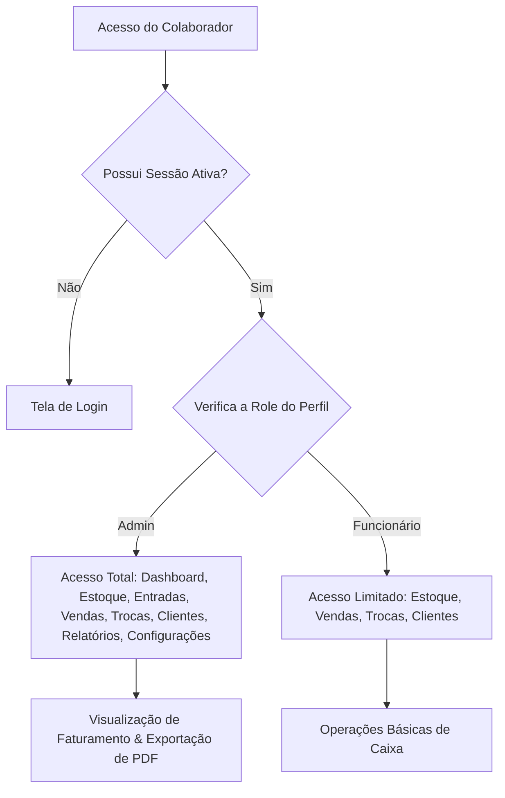
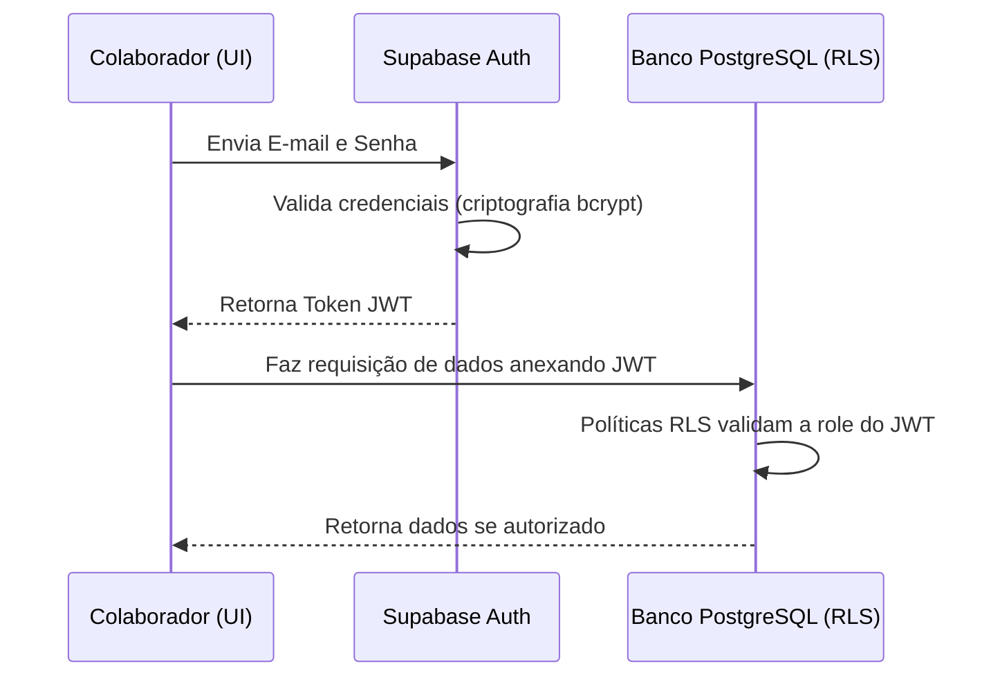

# 📖 Documentação Completa do Projeto: Zero 1

Este documento apresenta uma análise profunda, didática e estruturada de todo o ecossistema da aplicação **Zero 1**, englobando arquitetura, regras de negócio, modelagem de banco de dados, fluxo de telas, detalhamento de código e segurança.

---

## 1. Visão Geral do App

### Para que o app serve
O **Zero 1** é um sistema inteligente de controle de estoque, vendas e trocas direcionado ao comércio físico de bolsas e produtos de luxo. Ele serve como o ponto de venda (PDV) e console operacional principal, gerenciando o ciclo de vida do produto desde a entrada no estoque até a venda final ou eventuais trocas.

### Qual problema ele resolve
1. **Rastreamento Individual de Itens (Etiquetas de Código Único):** Diferente de comércios gerais com códigos de barras genéricos por lote, cada bolsa de luxo é tratada como uma peça individual de alto valor. O sistema utiliza identificadores únicos por etiqueta (ex: `LYP74589`), permitindo rastrear o histórico exato de cada bolsa.
2. **Conflito Financeiro no Processo de Troca:** No varejo de luxo, as trocas de produtos são extremamente comuns. O sistema automatiza o cálculo de diferença de valor em tempo real (seja cobrando a diferença do cliente ou gerando créditos de forma rastreável) e ajusta simultaneamente o status de estoque de ambos os produtos.
3. **Consolidação Financeira Incorreta:** Consolida dados em tempo real, fornecendo aos administradores relatórios precisos de faturamento diário e de período, além de monitorar o estoque total estático da loja e de emitir relatórios formatados em PDF para auditorias físicas de inventário.
4. **Furos de Estoque e Falta de Alerta Mínimo:** Fornece um painel reativo que exibe alertas imediatos quando qualquer item atinge a quantidade de segurança estipulada no cadastro.

### Como o fluxo principal funciona


---

## 2. Estrutura do Projeto

O projeto é estruturado como uma SPA (Single Page Application) desenvolvida em **React 19** e empacotada com o **Vite**, localizada no diretório `c:/Users/faisc/OneDrive/Desktop/AntiGravityEDTIS/Zero1Bags/`. Abaixo está a descrição detalhada dos arquivos mais importantes do sistema:

### Mapeamento dos Arquivos

1. **[index.html](file:///c:/Users/faisc/OneDrive/Desktop/AntiGravityEDTIS/Zero1Bags/index.html):**
   * Contém a estrutura básica HTML5.
   * Carrega as fontes premium do Google Fonts (`Inter` e `Hanken Grotesk`) e a biblioteca de ícones `Material Symbols Outlined`.
   * Inicializa o Tailwind CSS via CDN com uma extensão de tema personalizada (cores, fontes e escalas de espaçamento específicas).
   * Contém a div `#splash-loader` inline, que serve como uma tela de carregamento animada imediata, melhorando o desempenho percebido em conexões de dispositivos móveis antes do bundle do React ser carregado.
2. **[vite.config.js](file:///c:/Users/faisc/OneDrive/Desktop/AntiGravityEDTIS/Zero1Bags/vite.config.js):**
   * Configuração do empacotador Vite. Define a porta padrão do servidor de desenvolvimento como `5175` e ativa o host de rede (`host: true`), permitindo o acesso imediato de dispositivos móveis na mesma rede local Wi-Fi.
3. **[package.json](file:///c:/Users/faisc/OneDrive/Desktop/AntiGravityEDTIS/Zero1Bags/package.json):**
   * Gerencia scripts do ciclo de desenvolvimento (`dev`, `build`, `preview`) e as dependências externas. As principais bibliotecas instaladas são:
     * `@supabase/supabase-js` (comunicação com banco de dados e autenticação).
     * `framer-motion` (animações fluidas e micro-interações).
     * `react` e `react-dom` na versão 19.
4. **[src/main.jsx](file:///c:/Users/faisc/OneDrive/Desktop/AntiGravityEDTIS/Zero1Bags/src/main.jsx):**
   * O ponto de entrada da aplicação React. Inicializa a renderização do nó raiz.
   * Implementa um `ErrorBoundary` global. Caso o React encontre um erro fatal em tempo de execução, essa classe captura o erro e impede a "tela branca da morte", exibindo uma interface limpa com detalhes do erro e botão para recarregar a aplicação.
5. **[src/index.css](file:///c:/Users/faisc/OneDrive/Desktop/AntiGravityEDTIS/Zero1Bags/src/index.css):**
   * Estilização complementar customizada. Estiliza inputs, rolagem, sombras chocolate e as diretivas de impressão física.
   * Define regras `@media print` específicas que ocultam cabeçalhos, filtros de pesquisa e menus de navegação do layout A4 na hora de gerar relatórios, fazendo com que caibam perfeitamente na página sem quebras de layout.
6. **[src/supabaseClient.js](file:///c:/Users/faisc/OneDrive/Desktop/AntiGravityEDTIS/Zero1Bags/src/supabaseClient.js):**
   * Estabelece a conexão com a API do Supabase em nuvem, lendo do arquivo `.env`.
   * Contém proteção defensiva (bloco `try/catch`) para evitar que a aplicação trave em tela branca caso as chaves ambientais não tenham sido configuradas localmente.
7. **[src/App.jsx](file:///c:/Users/faisc/OneDrive/Desktop/AntiGravityEDTIS/Zero1Bags/src/App.jsx):**
   * Centraliza toda a inteligência e o gerenciamento de estados reativos do frontend. Contém a estruturação visual das telas, modais de busca, gerenciamento do carrinho de compras e funções assíncronas que interagem com o banco de dados.

---

## 3. Front-End

A interface do usuário é construída de forma reativa a partir de estados armazenados no [App.jsx](file:///c:/Users/faisc/OneDrive/Desktop/AntiGravityEDTIS/Zero1Bags/src/App.jsx). Ela é dividida em nove telas gerenciadas por meio do estado `activeTab`:

### Detalhamento das Telas

#### 1. Tela de Login e Autocadastro Inicial
* **Interface:** Formulário com layout premium centralizado, contendo campos para e-mail, senha e nome do colaborador.
* **Comportamento Dinâmico:** Se a função `checkIfSystemHasUsers` retornar zero usuários cadastrados na base, a tela se adapta automaticamente ao modo "Criar Administrador" na inicialização do sistema, realizando um registro do primeiro usuário admin. Nos acessos subsequentes, atua em modo de autenticação tradicional.

#### 2. Painel Dashboard (Restrito: Admin)
* **Interface:** Grid com cards volumétricos exibindo indicadores de desempenho (Faturamento Total, Faturamento Diário, Quantidade de Itens Vendidos, Quantidade Total de Peças em Estoque).
* **Alertas Visuais:** Exibe uma lista vermelha piscante de produtos em ponto crítico de estoque (`quantidade <= quantidade_minima`).

#### 3. Estoque Geral
* **Interface:** Um campo de pesquisa que filtra as bolsas instantaneamente por nome, marca ou código físico, acompanhado de seletores rápidos de cor, tamanho e material.
* **Ações:**
  * O clique em qualquer bolsa abre um modal contendo dados detalhados da peça, data de entrada e sua foto ampliada.
  * Para administradores, a visualização inclui botões rápidos de remoção de peça, edição direta de quantidades e o controle promocional (ativação de desconto).

#### 4. Cadastro de Entradas
* **Interface:** Formulário completo para inclusão de novos produtos no estoque.
* **Campos:** Código de etiqueta (ex: `LYP74589`), Nome, Marca, Cor, Material, Tamanho, Preço de Custo, Preço de Venda, Quantidade Inicial e Quantidade Mínima para Alerta.
* **Diferencial:** Permite o upload de arquivos de imagem diretamente para o Supabase Storage, associando a URL pública resultante ao produto cadastrado.

#### 5. Registrar Venda (Ponto de Venda - PDV)
* **Interface:** Sistema de busca e carrinho de compras.
* **Ações:**
  * O colaborador digita o código da bolsa no campo de pesquisa rápida e clica em **Adicionar**. O item é buscado localmente no estoque. Se houver quantidade disponível, é adicionado ao carrinho com validação reativa de limite.
  * Permite associar um cliente cadastrado e selecionar uma forma de pagamento (Dinheiro, PIX, Cartão de Crédito ou Débito).
  * Oferece campo de desconto manual em reais, que é rateado proporcionalmente entre as peças do carrinho.

#### 6. Registrar Troca
* **Interface:** Formulário inteligente para troca física de bolsas utilizando os códigos de etiqueta.
* **Ações:**
  1. O colaborador seleciona o cliente correspondente.
  2. Digita o **Código da Etiqueta Devolvida** e clica em **Buscar**. O sistema valida se o produto está cadastrado e localiza a última venda desse produto para o cliente selecionado. Se encontrado, exibe um card completo com a foto da bolsa e o preço de venda pago originalmente.
  3. Digita o **Código da Etiqueta da Nova Bolsa** desejada e clica em **Buscar**. O sistema valida se a bolsa nova possui estoque ativo. Se sim, renderiza um card completo com a foto do novo produto.
  4. Calcula reativamente o saldo resultante:
     * Se a bolsa nova for mais cara: exibe o saldo devedor que o cliente deve pagar e libera a seleção da forma de pagamento da diferença.
     * Se a bolsa nova for mais barata: exibe a mensagem informando o saldo credor gerado para o cliente.

#### 7. Clientes e Histórico
* **Interface:** Cadastro básico de clientes (Nome, Telefone, CPF e Email) e painel lateral expansível que busca todas as vendas históricas associadas ao ID do cliente selecionado.

#### 8. Relatórios (Restrito: Admin)
* **Interface:** Seleção de datas inicial/final para filtragem de movimentações.
* **Dados:** Lista tabelada e dividida em abas de Entradas de Estoque, Vendas Concluídas e Trocas Efetuadas no período.
* **Impressão:** Botão que executa `window.print()` renderizando uma página diagramada limpa em formato de auditoria física.

#### 9. Configurações e Colaboradores (Restrito: Admin)
* **Interface:** Lista de colaboradores ativos e formulário para convite e cadastro de novos funcionários com atribuição de privilégios (`role = 'admin'` ou `role = 'funcionario'`).

---

## 4. Back-End

O backend do projeto adota uma arquitetura Serverless suportada pelo **Supabase (PostgreSQL)**. As principais regras de negócio complexas e manipulações de dados transacionais ocorrem por meio de **RPCs (Remote Procedure Calls)** e funções armazenadas escritas em **PL/SQL**. Isso garante que operações críticas sejam atômicas e executadas diretamente no servidor do banco de dados, reduzindo o tráfego de rede e mitigando falhas de concorrência.

### Principais RPCs no Banco de Dados

#### 1. Transação de Venda Multitens (`registrar_venda_transacao`)
Esta função gerencia a criação de vendas para múltiplos itens simultaneamente dentro de um bloco transacional. Ela impede a venda caso o produto não possua saldo físico no exato momento da finalização do caixa.
```sql
CREATE OR REPLACE FUNCTION registrar_venda_transacao(
  p_cliente_id UUID,
  p_funcionario_id UUID,
  p_forma_pagamento TEXT,
  p_observacao TEXT,
  p_itens JSONB
) RETURNS VOID AS $$
DECLARE
  item RECORD;
  v_estoque_atual INT;
BEGIN
  -- Percorre cada item recebido no JSON do carrinho
  FOR item IN SELECT * FROM jsonb_to_recordset(p_itens) AS x(bolsa_id UUID, preco_vendido NUMERIC(10,2), tinha_desconto BOOLEAN, desconto_valor NUMERIC(10,2), observacao TEXT) LOOP
    
    -- Seleciona a quantidade em estoque atual com lock pessimista
    SELECT quantidade INTO v_estoque_atual FROM bolsas WHERE id = item.bolsa_id FOR UPDATE;
    
    IF v_estoque_atual < 1 THEN
      RAISE EXCEPTION 'Produto de ID % sem estoque disponível.', item.bolsa_id;
    END IF;

    -- Deduz do estoque físico do produto
    UPDATE bolsas 
    SET 
      quantidade = quantidade - 1,
      status = CASE WHEN (quantidade - 1) = 0 THEN 'vendida' ELSE 'disponivel' END,
      updated_at = NOW()
    WHERE id = item.bolsa_id;

    -- Registra a venda na tabela histórica
    INSERT INTO vendas (bolsa_id, cliente_id, funcionario_id, preco_vendido, tinha_desconto, desconto_valor, data, observacao, forma_pagamento)
    VALUES (item.bolsa_id, p_cliente_id, p_funcionario_id, item.preco_vendido, item.tinha_desconto, item.desconto_valor, CURRENT_DATE, item.observacao, p_forma_pagamento);
  
  END LOOP;
END;
$$ LANGUAGE plpgsql;
```

#### 2. Transação de Troca Física (`registrar_troca_transacao`)
Esta função assegura que o estoque da peça devolvida seja incrementado em `+1` (mudando seu status para `'disponivel'`), que o estoque da peça nova seja decrementado em `-1` (atualizando seu status para `'vendida'` se chegar a zero), e que a movimentação seja auditada financeiramente de forma atômica.
```sql
CREATE OR REPLACE FUNCTION registrar_troca_transacao(
  p_cliente_id UUID,
  p_bolsa_devolvida_id UUID,
  p_bolsa_nova_id UUID,
  p_funcionario_id UUID,
  p_motivo TEXT,
  p_diferenca_valor NUMERIC(10,2),
  p_forma_pagamento TEXT,
  p_venda_orig_id UUID
) RETURNS VOID AS $$
DECLARE
  v_estoque_nova INT;
BEGIN
  -- 1. Validar e travar estoque da bolsa nova
  SELECT quantidade INTO v_estoque_nova FROM bolsas WHERE id = p_bolsa_nova_id FOR UPDATE;
  IF v_estoque_nova < 1 THEN
    RAISE EXCEPTION 'Nova bolsa selecionada está sem estoque físico disponível!';
  END IF;

  -- 2. Inserir registro na tabela de trocas
  INSERT INTO trocas (cliente_id, bolsa_devolvida_id, bolsa_nova_id, funcionario_id, motivo, diferenca_valor, status, data)
  VALUES (p_cliente_id, p_bolsa_devolvida_id, p_bolsa_nova_id, p_funcionario_id, p_motivo, p_diferenca_valor, 'concluida', CURRENT_DATE);

  -- 3. Atualizar estoque da bolsa devolvida (volta a ficar disponível na loja)
  UPDATE bolsas 
  SET 
    quantidade = quantidade + 1,
    status = 'disponivel',
    updated_at = NOW()
  WHERE id = p_bolsa_devolvida_id;

  -- 4. Atualizar estoque da bolsa nova (sai do estoque da loja)
  UPDATE bolsas 
  SET 
    quantidade = quantidade - 1,
    status = CASE WHEN (quantidade - 1) = 0 THEN 'vendida' ELSE 'disponivel' END,
    updated_at = NOW()
  WHERE id = p_bolsa_nova_id;

  -- 5. Atualizar observação na venda original (se houver ID da venda informado)
  IF p_venda_orig_id IS NOT NULL THEN
    UPDATE vendas 
    SET observacao = COALESCE(observacao, '') || ' [Produto devolvido em processo de troca]'
    WHERE id = p_venda_orig_id;
  END IF;
END;
$$ LANGUAGE plpgsql;
```

### Exemplo de Chamada de RPC no Frontend (`src/App.jsx`)

Aqui está o exemplo de código JavaScript de como o [App.jsx](file:///c:/Users/faisc/OneDrive/Desktop/AntiGravityEDTIS/Zero1Bags/src/App.jsx) consome a RPC transacional de troca do Supabase:
```javascript
// Localizado em src/App.jsx (L1814-1826)
const { error: exchangeErr } = await supabase
  .rpc("registrar_troca_transacao", {
    p_cliente_id: formTroca.cliente_id,
    p_bolsa_devolvida_id: devolvida.id,
    p_bolsa_nova_id: nova.id,
    p_funcionario_id: profile.id,
    p_motivo: diferenca > 0 
      ? `${formTroca.motivo || "Troca de produto"}. Diferença paga via: ${formTroca.forma_pagamento?.toUpperCase() || "PIX"}`
      : formTroca.motivo,
    p_diferenca_valor: diferenca,
    p_forma_pagamento: formTroca.forma_pagamento || "pix",
    p_venda_orig_id: formTroca.venda_id || null
  });

if (exchangeErr) throw exchangeErr;
```

---

## 5. Banco de Dados

O banco de dados é um banco relacional **PostgreSQL** hospedado na infraestrutura do Supabase. A estrutura foi desenhada com relacionamentos estritos baseados em chaves estrangeiras (`FOREIGN KEY`) para preservar a consistência referencial dos dados históricos (vendas e trocas) mesmo se dados de produtos forem alterados.

### Diagrama Físico do Banco de Dados

```
   +------------------+         +------------------+         +------------------+
   |     profiles     |         |      bolsas      |         |     clientes     |
   +------------------+         +------------------+         +------------------+
   | id (PK)          |<---+    | id (PK)          |<---+    | id (PK)          |<---+
   | nome             |    |    | codigo (Unique)  |    |    | nome             |    |
   | role             |    |    | nome             |    |    | cpf (Unique)     |    |
   | ativo            |    |    | preco_venda      |    |    +------------------+    |
   +------------------+    |    | quantidade       |    |                            |
                           |    +------------------+    |                            |
                           |              ^             |                            |
     +---------------------+              |             +-----------------------+    |
     |                                    |                                     |    |
     v                                    v                                     v    |
 +------------------+             +------------------+                      +------------------+
 |     entradas     |             |      vendas      |                      |      trocas      |
 +------------------+             +------------------+                      +------------------+
 | id (PK)          |             | id (PK)          |                      | id (PK)          |
 | bolsa_id (FK) ───|------------>| bolsa_id (FK)    |                      | cliente_id (FK) ─|----+
 | funcionario_id(FK)             | cliente_id (FK) ─|─────────────────────>| bolsa_devolvida(FK)
 +------------------+             | funcionario_id(FK)                      | bolsa_nova (FK)  |
                                  +------------------+                      | funcionario_id(FK)
                                                                            +------------------+
```

### Detalhamento dos Campos e Relacionamentos

* **`profiles`:**
  * `id` (`uuid`, Primary Key): Mapeado e vinculado diretamente ao ID interno gerado pelo Supabase Auth (`auth.users`).
  * `nome` (`text`, `not null`): Nome de exibição do colaborador.
  * `role` (`text`): Campo de privilégio. Pode ser `'admin'` ou `'funcionario'`.
  * `ativo` (`boolean`, default `true`): Permite revogar o acesso do colaborador ao sistema sem deletar seu histórico de vendas.
* **`bolsas`:**
  * `id` (`uuid`, Primary Key): Identificador gerado aleatoriamente (`gen_random_uuid()`).
  * `codigo` (`text`, `unique`, `not null`): Código único da etiqueta do produto físico (chave de busca rápida).
  * `preco_custo` e `preco_venda` (`numeric(10,2)`): Armazenamento monetário preciso.
  * `preco_desconto` e `desconto_ativo`: Controle de promoções na loja.
  * `status` (`text`): Estado físico da bolsa (`'disponivel'`, `'vendida'`, `'trocada'`, `'reservada'`).
* **`entradas`:** Log de auditoria de reabastecimento de estoque. Aponta para a bolsa (`bolsa_id`) e para o colaborador responsável pela entrada.
* **`clientes`:** Cadastro de clientes. O campo `cpf` é único para evitar duplicações de cadastro de fidelidade.
* **`vendas`:** Armazena o histórico das vendas concluídas, gravando o preço efetivamente cobrado (`preco_vendido`) para permitir descontos variáveis sem afetar o preço base do produto.
* **`trocas`:** Tabela operacional de trocas físicas. Liga o cliente, a bolsa devolvida, a bolsa nova e o colaborador, armazenando a diferença financeira.

---

## 6. Login, Senha e Segurança

A segurança do aplicativo é estruturada através da integração entre o frontend e a infraestrutura de backend.

### Como funciona o fluxo de segurança:



1. **Autenticação:** O login é processado via Supabase Auth. As senhas são protegidas com criptografia de mão única (**bcrypt**) diretamente no servidor de autenticação do Supabase. O backend gera um JSON Web Token (JWT) assinado.
2. **Sessão:** O token JWT é armazenado de forma segura no LocalStorage do navegador. O cliente Supabase anexa automaticamente o JWT no cabeçalho `Authorization: Bearer <token>` em todas as chamadas SQL feitas no frontend.
3. **Segurança de Banco de Dados (Row Level Security - RLS):**
   * O RLS está habilitado em 100% das tabelas do banco de dados.
   * **Política Admin:** Apenas requisições contendo um JWT que corresponda a um perfil com `role = 'admin'` na tabela `profiles` recebem autorização para realizar operações de escrita (`INSERT`, `UPDATE`, `DELETE`) na tabela de `bolsas` ou criar cadastros na tabela `profiles`.
   * **Política Funcionário:** Usuários autenticados com a role `'funcionario'` possuem permissão de leitura total nas tabelas `bolsas`, `clientes` e `vendas`, e permissão de escrita em `vendas`, `trocas` e `clientes`.
4. **Proteção no Frontend:** O arquivo [App.jsx](file:///c:/Users/faisc/OneDrive/Desktop/AntiGravityEDTIS/Zero1Bags/src/App.jsx) possui checagens constantes de permissões no estado local. Se um colaborador logado com perfil de funcionário tentar acessar as abas confidenciais de relatórios ou configurações, o código reage redirecionando o usuário de volta para a aba de estoque:
   ```javascript
   // Localizado em src/App.jsx (L1743-1746)
   if (activeTab === "relatorios" && profile?.role !== "admin") {
     setActiveTab("estoque");
   }
   ```

### Riscos de Segurança Identificados & Mitigações

1. **Uso de Chave Pública no Frontend:**
   * **Risco:** As variáveis `VITE_SUPABASE_URL` e `VITE_SUPABASE_ANON_KEY` ficam expostas no código público do cliente. Qualquer usuário experiente pode extraí-las e tentar enviar comandos SQL diretamente para o endpoint do Supabase.
   * **Mitigação:** Como as diretivas RLS estão rigorosamente ativas no PostgreSQL, qualquer tentativa de inserção ou alteração maliciosa por um usuário sem a chave de autenticação JWT correspondente a um Administrador será sumariamente rejeitada pelo banco de dados.
2. **Fallback reativo em falhas de rede:**
   * **Risco:** Caso a busca do perfil falhe durante o login devido a oscilações de rede, a aplicação poderia conceder privilégios inadequados.
   * **Mitigação:** O sistema implementa uma tratativa defensiva (`App.jsx` na linha 322). Em caso de erro ao obter o perfil, o estado assume por segurança a role `'funcionario'`, que é a mais restritiva, impedindo a escalada de privilégios acidental.

---

## 7. Regras de Negócio do Sistema

| Regra de Negócio | Descrição Técnica | Implementação no Código |
| :--- | :--- | :--- |
| **Autocadastro de Admin** | Se o banco de dados estiver completamente vazio na primeira inicialização, o formulário de login muda para modo "Cadastrar Administrador" para permitir a criação da primeira conta master. | `checkIfSystemHasUsers` chama a RPC `system_has_users` e altera o estado `hasUsers` para `false` no [App.jsx](file:///c:/Users/faisc/OneDrive/Desktop/AntiGravityEDTIS/Zero1Bags/src/App.jsx). |
| **Estoque Mínimo (Alerta)** | Exibe alertas críticos no painel do Dashboard se a quantidade física de um modelo de bolsa em estoque for menor ou igual ao limite de segurança configurado no seu cadastro. | Verifica se `bolsa.quantidade <= bolsa.quantidade_minima` na renderização dos cards em [App.jsx](file:///c:/Users/faisc/OneDrive/Desktop/AntiGravityEDTIS/Zero1Bags/src/App.jsx). |
| **Validação Física de Estoque** | É proibido processar uma venda ou uma troca que inclua um produto cuja quantidade física em estoque seja igual a zero. | Tratado de forma redundante: no validador do carrinho do frontend e por transação transacional (`FOR UPDATE`) nas RPCs do PostgreSQL. |
| **Controle de Alçada (Acesso)** | Funcionários normais não podem alterar preços de produtos, aplicar descontos fixos de estoque, excluir mercadorias ou visualizar relatórios financeiros. | Validação condicional `profile?.role === 'admin'` para habilitar botões de edição e RLS do Supabase impedindo a escrita direta. |
| **Etiqueta Exclusiva** | Cada bolsa deve obrigatoriamente possuir um código de etiqueta único e exclusivo no banco de dados para indexar as buscas físicas de caixas e sacolas. | Restrição física de coluna `codigo TEXT UNIQUE` na tabela `bolsas` do banco de dados PostgreSQL. |
| **Saldo Financeiro em Trocas** | Se a nova bolsa for mais cara na troca, a diferença é cobrada especificando a forma de pagamento. Se for mais barata, exibe a notificação com o valor de crédito gerado. | Cálculo reativo `diferenca = precoNova - precoPagoOriginal` no escopo da função `handleSaveTroca` em [App.jsx](file:///c:/Users/faisc/OneDrive/Desktop/AntiGravityEDTIS/Zero1Bags/src/App.jsx). |

---

## 8. Fluxo Completo do Sistema (Passo a Passo)

Abaixo está o ciclo de vida de uma operação comum: **A realização de uma Troca por Etiqueta Física**.

1. **Inicialização do App:** O colaborador acessa o aplicativo em seu celular ou no computador da loja. O `#splash-loader` é exibido enquanto o bundle React é inicializado no navegador.
2. **Autenticação:** O colaborador digita suas credenciais de acesso. O Supabase valida o login e retorna o JWT, liberando a navegação para a tela de **Estoque**.
3. **Navegação para Trocas:** No menu lateral da interface, o colaborador clica em **Registrar Troca**.
4. **Associação do Cliente:** O colaborador seleciona no seletor de busca o cliente que está realizando a troca de produtos.
5. **Busca da Bolsa Devolvida:** O colaborador digita o código da etiqueta do produto que está sendo devolvido (ex: `LYP74589`) e pressiona Enter.
6. **Validação da Devolução:** A função `handleBuscarCodigoDevolvido` localiza o produto no estoque, busca no histórico de vendas do sistema a compra daquela bolsa vinculada ao cliente selecionado, valida as datas e exibe o card visual do produto devolvido com a foto e o preço exato pago na venda original.
7. **Busca da Nova Bolsa:** O colaborador digita o código da nova bolsa que o cliente escolheu levar e clica em **Buscar**.
8. **Validação da Nova Bolsa:** A função `handleBuscarCodigoNovo` localiza o produto no estoque, certifica-se de que a quantidade física é superior a 0 e exibe o card visual da nova peça com o seu respectivo preço de venda atual (aplicando descontos, caso o produto esteja em promoção).
9. **Cálculo de Diferença Financeira:** O sistema calcula em tempo real o saldo da transação. Se houver saldo devedor, o colaborador seleciona a forma de pagamento que o cliente utilizou para quitar a diferença.
10. **Processamento da Transação:** O colaborador digita o motivo da troca e clica em **Concluir Troca**.
11. **Finalização Transacional:** O aplicativo chama a RPC `registrar_troca_transacao` no Supabase. O banco de dados incrementa a quantidade do devolvido, decrementa a do novo produto, atualiza os status das duas bolsas de forma atômica e salva o registro na tabela `trocas`. O frontend é limpo e atualizado de forma síncrona.

---

## 9. Dependências e Tecnologias

A aplicação foi desenvolvida focando em máxima velocidade de carregamento em dispositivos móveis e robustez de banco de dados.

* **Vite:** Ferramenta de compilação rápida para o ecossistema frontend, oferecendo HMR (Hot Module Replacement) instantâneo que agiliza o desenvolvimento.
* **React 19:** Biblioteca modular focada em interfaces baseadas em componentes declarativos. Permite criar estados reativos eficientes que atualizam a tela sem recarregar a página.
* **Tailwind CSS (CDN com Plugins):** Framework utilitário de CSS. Utilizado para criar a folha de estilo premium em tons escuros e dourado, utilizando classes diretamente no HTML, reduzindo arquivos CSS redundantes.
* **@supabase/supabase-js:** O SDK de cliente para JavaScript do Supabase. Utilizado para efetuar chamadas seguras à API do banco, Auth e Storage através de requisições assíncronas assinaladas com JWT.
* **Framer Motion:** Biblioteca de animação para React. Utilizada para suavizar transições de abas, abertura de gavetas de menus e modais de foto das bolsas.

---

## 10. Como Rodar o Projeto

Siga os passos abaixo para preparar o ambiente de desenvolvimento e iniciar a aplicação localmente:

### 1. Instalação das Dependências
Abra o terminal de comandos do seu sistema operacional na pasta raiz do projeto (`Zero1Bags`) e execute:
```bash
npm install
```

### 2. Configuração de Variáveis de Ambiente
Crie um arquivo chamado `.env` na raiz do projeto (no mesmo nível do arquivo `package.json`) e insira as credenciais do seu projeto Supabase:
```env
VITE_SUPABASE_URL=https://sua-url-projeto-supabase.supabase.co
VITE_SUPABASE_ANON_KEY=eyJhbGciOiJIUzI1NiIsInR5cCI6IkpXVCJ9.seu-token-anonimo-gerado-no-painel...
```

### 3. Iniciar o Servidor em Modo de Desenvolvimento (Local e Rede Móvel)
Para rodar o projeto localmente com suporte a testes em smartphones conectados à mesma rede Wi-Fi, execute:
```bash
npm run dev
```
O console exibirá os endereços de acesso IP:
* **Acesso Local (Computador):** [http://localhost:5175/](http://localhost:5175/)
* **Acesso de Rede (Mobile):** [http://192.168.1.174:5175/](http://192.168.1.174:5175/)

### 4. Compilação para Produção
Para compilar e otimizar todos os arquivos estáticos da aplicação gerando o bundle de produção na pasta `/dist`, execute:
```bash
npm run build
```
Para testar o build de produção localmente simulando o servidor final, execute:
```bash
npm run preview
```

---

## 11. Pontos de Melhoria e Recomendações

1. **Refatoração e Componentização do `App.jsx`:**
   * **Problema:** O arquivo [App.jsx](file:///c:/Users/faisc/OneDrive/Desktop/AntiGravityEDTIS/Zero1Bags/src/App.jsx) concentra mais de 7.000 linhas de código, acumulando lógica de estado, chamadas de API, estilizações e estruturas de layout das 9 abas.
   * **Recomendação:** Dividir o arquivo em componentes menores na pasta `src/components/` (ex: `EstoqueTab.jsx`, `TrocasTab.jsx`, `DashboardTab.jsx`, `VendasTab.jsx`). Isso facilita testes unitários, isolamento de escopo e manutenção do código por múltiplos programadores.
2. **Gerenciamento de Estado Global:**
   * **Problema:** O fluxo de dados utiliza props-drilling e estados altamente acoplados no componente principal.
   * **Recomendação:** Migrar o estado compartilhado de dados da aplicação (listas de bolsas, clientes e perfil do usuário logado) para uma biblioteca leve de gerenciamento de estado como o `Zustand` ou usar a `Context API` nativa do React.
3. **Segurança no Upload de Arquivos (Storage):**
   * **Problema:** O sistema realiza o upload de imagens de produtos diretamente do navegador do usuário.
   * **Recomendação:** Limitar no Supabase Storage o tamanho máximo de arquivo de upload (ex: 2MB) e restringir os tipos de MIME aceitos exclusivamente para imagens (`image/jpeg`, `image/png`, `image/webp`), evitando o armazenamento de arquivos indesejados.
4. **Validação Robusta de Formulários:**
   * **Problema:** As validações de campos no frontend contam com checagens básicas de valores vazios, podendo sofrer com a inserção de formatos incorretos (como CPFs inválidos ou preços negativos).
   * **Recomendação:** Implementar esquemas de validação de formulários declarativos usando bibliotecas como o `Zod` combinada com o `React Hook Form` para garantir a integridade dos tipos e formatos antes do envio das requisições para o banco.
